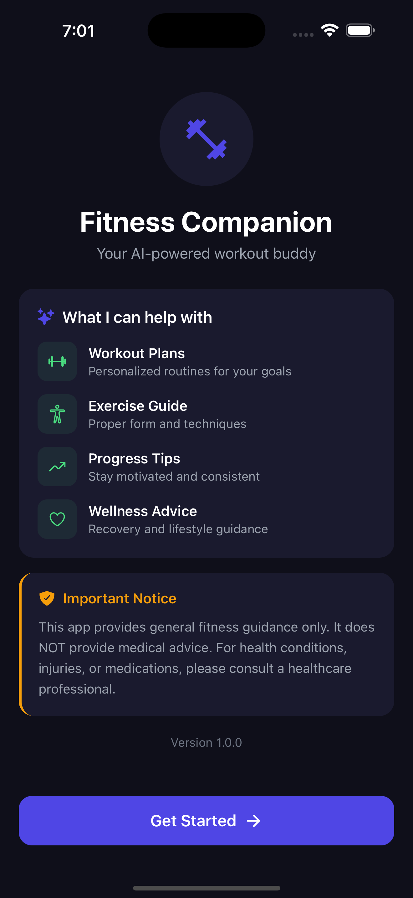
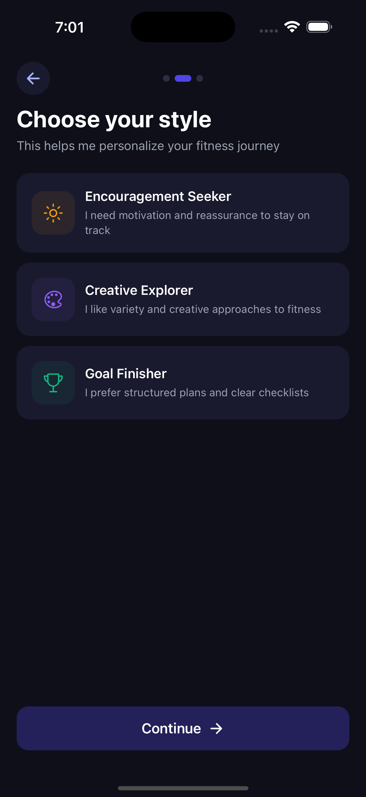
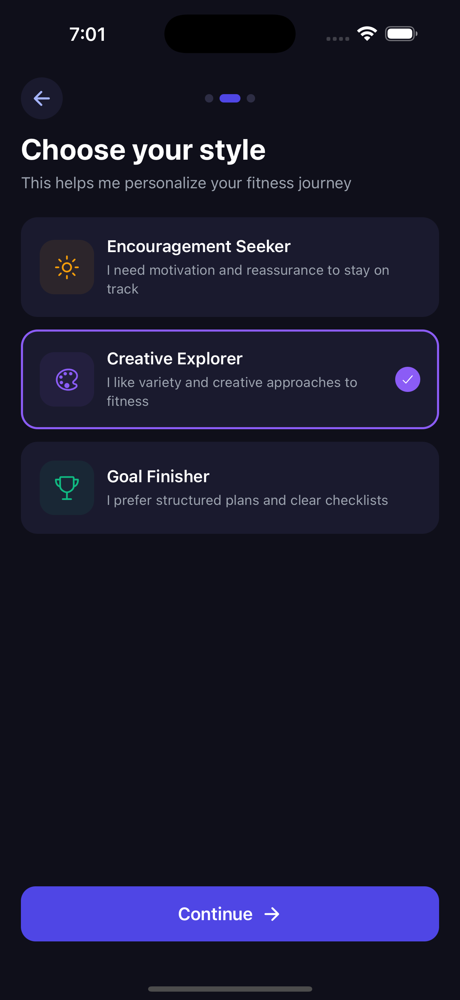
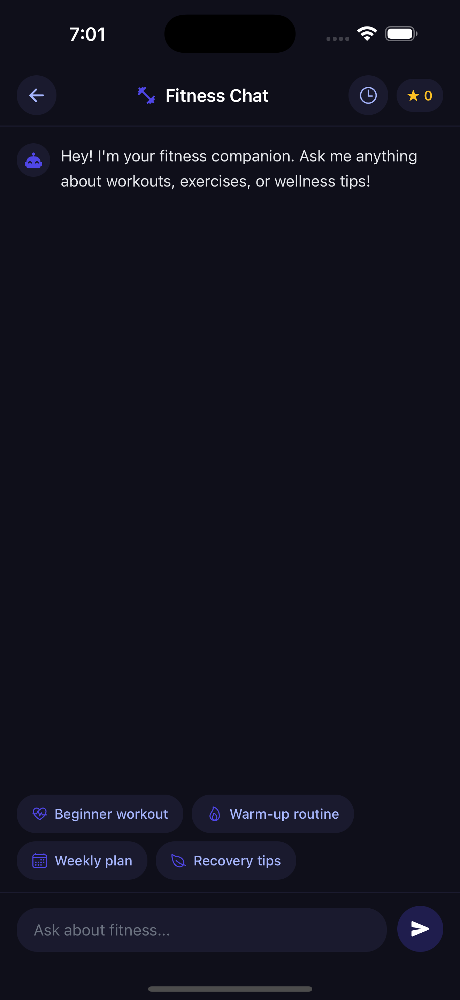
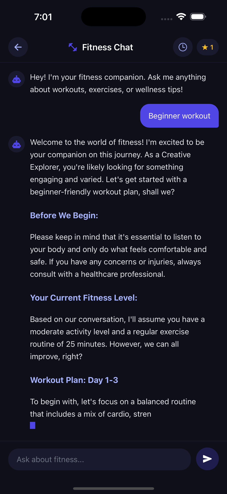
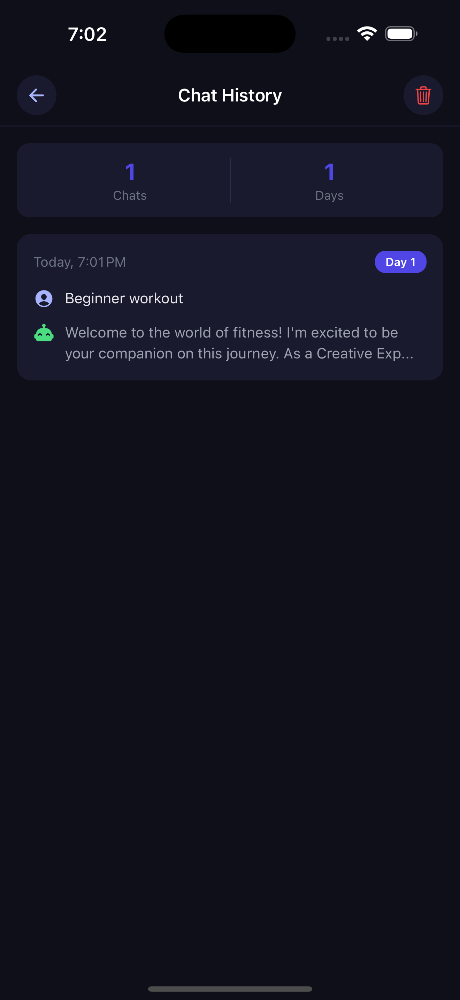

# 🏋️ Adaptive Fitness Companion Chatbot

An AI-powered fitness companion chatbot built with React Native (Expo) and Node.js backend. The chatbot adapts its behavior based on user personality, usage duration, and lifestyle context.

---

## 🎬 Demo Video

[](https://drive.google.com/file/d/1QCBc7oK4dRcGIMxxqRbDfssy1Ye8pQLZ/view?usp=sharing)

---

## 📱 Screenshots

<div align="center">
<table width="100%">
  <tr>
    <td width="33%"></td>
    <td width="33%"></td>
    <td width="33%"></td>
  </tr>
  <tr>
    <td align="center"><b>Welcome Screen</b></td>
    <td align="center"><b>Personality Selection</b></td>
    <td align="center"><b>Style Selected</b></td>
  </tr>
  <tr>
    <td width="33%"></td>
    <td width="33%"></td>
    <td width="33%"></td>
  </tr>
  <tr>
    <td align="center"><b>Chat Screen</b></td>
    <td align="center"><b>AI Response</b></td>
    <td align="center"><b>Chat History</b></td>
  </tr>
</table>
</div>

---

## 🛠️ Tech Stack

| Category | Technology |
|----------|------------|
| Frontend | React Native (Expo Managed Workflow) |
| Backend | Node.js + Express |
| Database | MongoDB |
| AI | Groq API (LLaMA 3.1 8B) |
| Expo SDK | 54 |

---

## ✨ Features

### Core Features
- ✅ Welcome screen with app introduction and disclaimer
- ✅ Personality-based onboarding (3 personality types)
- ✅ Chat interface with structured AI responses
- ✅ Typing animation (ChatGPT-style effect)
- ✅ Day-wise workout plans, bullet-point tips
- ✅ Follow-up quick action pills
- ✅ Coin reward system (1 coin per message)
- ✅ Safety guardrails for medical content

### Bonus Features
- ✅ Chat history screen (last 10 conversations)
- ✅ Clear history functionality
- ✅ Dark theme with consistent styling
- ✅ Responsive design for all devices

---

## 🚀 How to Run

### Prerequisites
- Node.js 20.x (LTS)
- MongoDB running locally
- Groq API key (free at [console.groq.com](https://console.groq.com))

### Step 1: Clone the Repository
```bash
git clone <your-repo-url>
cd fitness-chatbot
```

### Step 2: Backend Setup
```bash
cd backend
npm install
```

Create a `.env` file in the `backend` folder:
```env
MONGODB_URI=mongodb://localhost:27017/fitness-chatbot
GROQ_API_KEY=your_groq_api_key_here
PORT=3000
```

Start the backend server:
```bash
npm start
```

### Step 3: Frontend Setup
```bash
npm install
npx expo start
```

### Step 4: Run the App
- Press `w` → Web browser
- Press `i` → iOS simulator
- Press `a` → Android emulator
- Scan QR code with Expo Go app

---

## 📖 How to Use

| Step | Action |
|------|--------|
| 1 | Read the welcome screen and tap **Get Started** |
| 2 | Choose your personality type (A, B, or C) |
| 3 | Start chatting about fitness, workouts, wellness |
| 4 | Use quick action pills for common queries |
| 5 | View chat history by tapping the clock icon |

### Example Questions
- "Create a beginner workout plan for 3 days a week"
- "What are good warm-up exercises before running?"
- "How can I stay consistent with workouts?"
- "Give me 5 tips for better posture"

---

## 📁 Project Structure

```
├── app/
│   ├── _layout.tsx      # Root navigation
│   ├── index.tsx        # Welcome screen
│   ├── onboarding.tsx   # Personality selection
│   ├── chat.tsx         # Main chat interface
│   └── history.tsx      # Chat history
├── backend/
│   ├── controllers/     # Route handlers
│   ├── models/          # MongoDB schemas
│   ├── routes/          # API routes
│   ├── services/        # AI service (Groq)
│   ├── utils/           # Prompt composer, safety
│   └── server.js        # Express server
├── config/              # API configuration
└── assets/              # Images & screenshots
```

---

## 🔌 API Endpoints

| Method | Endpoint | Description |
|--------|----------|-------------|
| POST | `/api/user/create` | Create user with personality |
| GET | `/api/user/:userId` | Get user profile |
| PUT | `/api/user/:userId/lifestyle` | Update lifestyle data |
| POST | `/api/chat/message` | Send message, get AI response |
| GET | `/api/chat/history/:userId` | Get chat history |
| DELETE | `/api/chat/history/:userId` | Clear chat history |

---

## ✅ Demo Checklist

- [x] Welcome screen with disclaimer
- [x] Personality selection during onboarding
- [x] Chat interaction with structured responses
- [x] Personality-based AI behavior
- [x] Usage-duration adaptation
- [x] Lifestyle context consideration
- [x] Safety refusal for medical queries
- [x] Coin reward system
- [x] Chat history screen
- [x] Responsive design for all devices

---

<div align="center">

### 👨‍💻 Created by **Adarsh Priydarshi**

[](https://github.com/adarsh-priydarshi-5646)

**Happy Coding!** 💪🏋️

</div>
